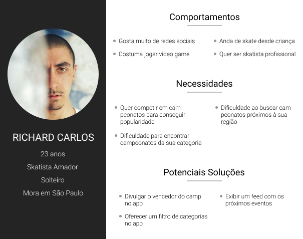
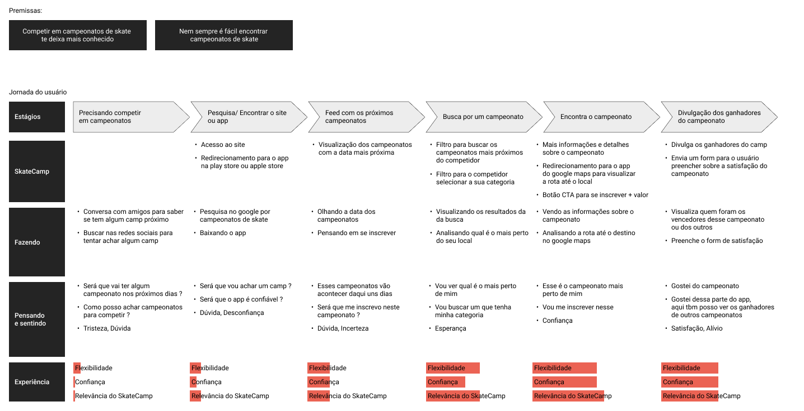
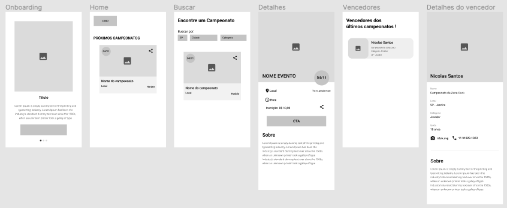
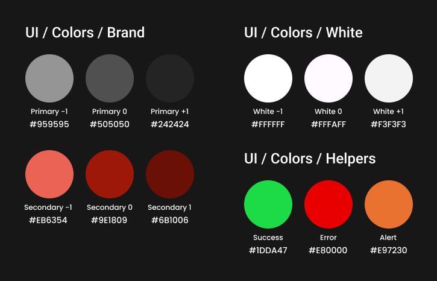
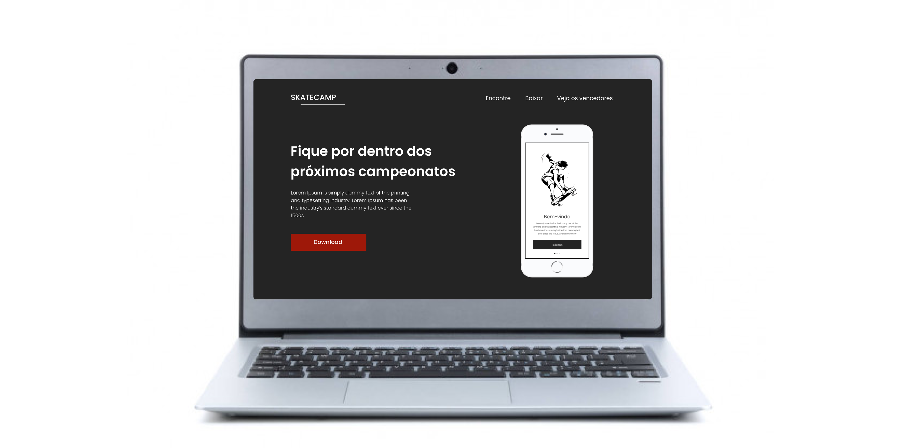
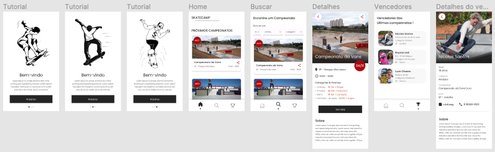
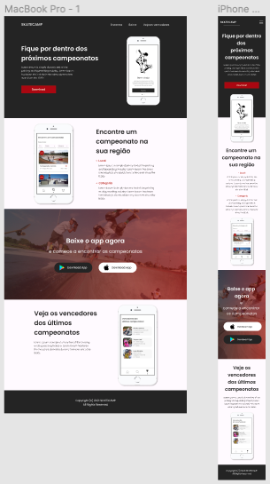

 
 
 

    <a href="#-entendendo-o-problema">Problema</a> •
    <a href="#-why">Why</a> •
    <a href="#2-who">Who</a> • 
    <a href="#-3-where-/-when">Where/When</a> • 
    <a href="#-4-what">What</a> • 
    <a href="#-5-how">How</a> • 
    <a href="#-autor">Autor</a> • 

 

## **🚫 Entendendo o problema**
Para começar a compreender o problema, listei suposições iniciais para me guiar e me organizar. Depois fiz um bate-papo com alguns colegas skatistas para poder validar essas suposições e identifiquei as seguintes premissas:

- **_Competir em campeonatos de skate te deixa mais conhecido_**
- **_Nem sempre é fácil encontrar campeonatos de skate_**

A partir disso, comecei a elaborar o **Briefing** do projeto com base no plano de ação <a href="https://agrego.net/5w1h/">5W1H</a>.

---

## **1 Why?**

#### **Definição**
O problema a ser resolvido: skatistas com dificuldade em achar campeonatos de skate.

Os benefícios que pretendem ser alcançados são a facilidade na busca por um campeonato de skate e também a divulgação destes campeonatos.

Com isso poderá criar oportunidades de negócio para os skatistas competirem e ganhar mais popularidade, ou até mesmo algum patrocínio, e também para os organizadores do evento para divulgar o campeonato.

#### **Storytelling**
Utilizei esta ferramenta com o intuito de detalhar alguns aspectos da rotina do usuário e como poderia solucionar o seu problema.

>  _**Era uma vez** um skatista chamado Richard que morava no centro de São Paulo._ 
_**Todos os dias** ele andava de skate com o objetivo de ser um skatista profissional._  
_**Um certo dia** ele decidiu que iria participar dos campeonatos de skate._  
_**Por causa disso** ele pesquisou quais eram os campeonatos que haviam no momento e foi competir._  
_**Por causa disso** ele venceu alguns dos campeonatos, ganhou patrocinios e sua popularidade aumentou._  
_**Até que finalmente** ele começou a competir profissionalmente em campeonatos de skate._  

---

## **2 Who?**
Essa parte foi a hora de definir o público-alvo que queria atingir.

#### **Personas**
Criei uma persona para representar melhor o público-alvo e como os usuários iriam utilizar o serviço.

---

## **3 Where/When?**
Os skatistas tem dificuldade para serem patrocinados pelas marcas. Muitas vezes, o patrocíonio só vem de acordo com o nível de popularidade que o skatista tem.

A partir das dificuldade encontradas, criei a jornada do usuário para estudar e acompanhar os passos do começo do problema até a solução, para identificar suas possíveis tomadas de decisão e como ele se sente.

---

## **4 What?**

#### **Priorização e Ideias de solução**
A solução proposta será importante para que os usuários possam encontrar campeonatos de skate com mais facilidade.

Sendo assim, será projetado um app mobile onde ele poderá ver quais seram os próximos campeonatos juntamente com mais informações sobre o evento, como as categorias disponíveis para competir, o local, as premiações, etc.

Na parte web, será projetada uma Landing page para apresentar a proposta de valor do app e os links para download nas lojas (Play Store, Apple Store).

#### **Workflow**
Nesse parte do projeto, escrevi os fluxo das telas da versão mobile, passando pelas fases:

_Tela 1 - Onboarding_
_Tela 2 - Home exibindo os campeonatos mais próximos da data atual_
_Tela 3 - Buscar um campeonato por estado, cidade ou categoria do competidor_
_Tela 4 - Mais informações sobre um determinado campeonato_
_Tela 5 - Visualizar a rota do local atual até o local do campeonato_
_Tela 6 - Visualizar os vencedores dos últimos campeonatos_
_Tela 7 - Mais informações sobre o vencedor do último campeonato_

#### **Wireframes**
Com base no Workflow, comecei a projetar as wireframes do projeto:

##### Mobile:

  

##### Landing Page Web:

#### **Styleguide**

Depois de pensado na proposta para a estrutura do app e da Landing Page, foi criado o guia de estilos para consolidar o visual.

_<ins>Estilo de cores:</ins>_ escolha de tons fortes, cinza cor da neutralidade, assim ajuda a deixar visual mais minimalista, e o vermelho cor da energia, deixando o layout equilibrado e confortável para navegação do usuário.

 

_<ins>Tipografia:</ins>_ a tipografia escolhida foi a Poppins pois oferece muitas variedades de peso da fonte e também fornece uma ótima leiturabilidade.

 

_<ins>Componentes:</ins>_ os componentes como botão e input foram pensados de acordo com as cores principais da palheta de cores e a tipografia do styleguide.

 

#### **O Protótipo**
Depois de pronto o esqueleto do site e feito o guia de estilos, hora de aplicá-los no protótipo de alta fidelidade.

    

##### Mobile

##### Landing Page Web

 

> Você pode ver o protótipo de alta fidelidade feito no figma <a href="https://www.figma.com/proto/4E5WDAWrqxWENtKo4WRm4k/SkateCamp?page-id=74%3A0&node-id=91%3A31&viewport=245%2C48%2C0.25&scaling=scale-down&starting-point-node-id=91%3A31">aqui</a>. 

---

## **5 How?**

**Métricas de Sucesso**
Para saber se a solução realmente funcionou e resolveu o problema do usuário, será feito uma pesquisa verificando se há mais participações dos skatistas nos campeonatos e também se aumentou o nível de popularidade dos skatistas vencedores nas redes sociais.

---

## 👨🏽‍💻 **Autor**

<a>
 
 
 <b>Nicolas Santos</b></a> <a>🚀</a>
  

 

 