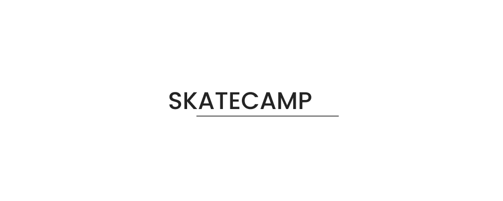

<br />
 
 <p align="center">
    <a href="#-sobre-o-projeto">Sobre</a> •
    <a href="#-demonstração">Demonstração</a> •
    <a href="#-tecnologias">Tecnologias</a> • 
    <a href="#-como-executar-o-projeto">Como executar</a> • 
    <a href="#-autor">Autor</a> • 
    <a href="#-licença">Licença</a> • 
</p><br />

<h4 align="center"> 
	✅ &nbsp; Status do projeto: <b>Concluído</b> &nbsp;✅ 
</h4><br />

## **💻 Sobre o projeto**

Skatecamp - é uma forma de facilitar a busca por campeonatos de skate e de organizadores divulgarem esses eventos na plataforma.

Projeto desenvolvido com o intuito de praticar e aprimorar meus conhecimentos em UX & UI design, desenvolvimento mobile e desenvolvimento web responsivo.
<br />

---

## **🎨 Design**
Recentemente realizei o curso de Design de Interfaces lecionado pelo Leandro Rezende, decidi então aplicar os conhecimentos e habilidades obtidos no curso neste projeto. Todo processo de design que realizei você pode conferir no arquivo <a href="./README-Design.md" target="_blank">README-Design.md</a>.

---

## **👀 Demonstração**
Abaixo está uma breve demonstração em formato gif sobre o projeto Web e o projeto Mobile.
<p style="font-size: 14px; font-weight: bold">Web:</p> 
<p align="center" style="display: flex; align-items: flex-start; justify-content: center;">
    
    <br /><br />
</p><br />

<p style="font-size: 14px; font-weight: bold">Mobile:</p>
<p align="center" style="display: flex; align-items: flex-start; justify-content: center;">
    
</p>
<br />

--- 

## **🛠 Tecnologias**
As seguintes ferramentas foram usadas na construção do projeto:

&nbsp; Web:
- Html
- Javascript
- Jquery
- [Sass](https://sass-lang.com/)
- [Bootstrap v.5](https://getbootstrap.com/docs/5.0/getting-started/introduction/)
- [GSAP](https://greensock.com/gsap/)

&nbsp; Mobile:

- [Ionic v.5](https://ionicframework.com/)
- [Ionic Angular](https://ionicframework.com/docs/angular/overview)
- [Cordova](https://ionicframework.com/docs/native/community)
- [Sass](https://sass-lang.com/)
- Typescript<br />

---

## **🚀 Como executar o projeto**

Este projeto é divido em duas partes: 
1. Web (pasta web)
2. Mobile (pasta app)

### **Pré-requisitos**

Antes de começar, você vai precisar ter instalado em sua máquina as seguintes ferramentas:
[Git](https://git-scm.com), [Node.js](https://nodejs.org/en/). 
Além disto é bom ter um editor para trabalhar com o código como [VSCode](https://code.visualstudio.com/) <br /> <br />

#### 💻 &nbsp; **Rodando a aplicação web**

```bash

# Clone este repositório
$ git clone https://github.com/N1ck-gif/skatecamp.git

```
Após este procedimento, basta abrir o arquivo **index.html** dentro da pasta **web** para iniciar o projeto.<br /><br />
#### 📱 &nbsp; **Rodando a aplicação mobile**

```bash

# Clone este repositório
$ git clone https://github.com/N1ck-gif/skatecamp.git

# Acesse a pasta do projeto no seu terminal/cmd
$ cd skatecamp

# Vá para a pasta da aplicação mobile
$ cd app

# Instale as dependências
$ npm install

# Execute a aplicação
$ ionic serve

# A aplicação será aberta na porta:8100 - acesse http://localhost:8100/

```

---

## 👨🏽‍💻 **Autor**

<a>
 
 
 <sub><b>Nicolas Santos</b></sub></a> <a>🚀</a>
 <br />

[](https://www.linkedin.com/in/nicolas-santos-487bb81ba/) 
[](mailto:ns5077900@gmail.com)
<br />

---

## 📝 **Licença**
Este projeto esta sobe a licença [MIT](./LICENSE).
